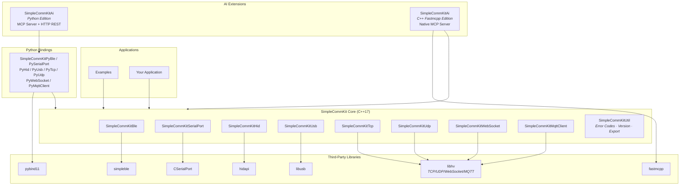

# SimpleCommKit

[](LICENSE)
[](https://en.cppreference.com/w/cpp/17)
[]()

[中文文档](README_CN.md)

**SimpleCommKit** is a cross-platform C++ communication library that unifies multiple low-level communication protocols under a clean, consistent API — so you never worry about platform-specific implementation details.

---

## ✨ Features

- **Unified API**: All protocol modules follow consistent naming and invocation patterns, minimizing the learning curve
- **Cross-Platform**: Windows / Linux / macOS / iOS / Android support
- **Structured Error Codes**: 32-bit hierarchical error codes for fast problem localization
- **Consistent Callbacks**: `setCallback_OnXxx` style event callbacks with uniform error handling
- **PIMPL Design**: Stable public interfaces with fully hidden implementation details and good ABI compatibility
- **TLS/SSL**: Built-in TLS encryption for TCP, WebSocket, and MQTT
- **Auto-Reconnect**: Configurable exponential backoff reconnection for TCP, WebSocket, and MQTT clients
- **Hot-Plug Detection**: Device hot-plug polling for SerialPort, HID, and USB modules

---

## 📦 Supported Protocols

| Module | Protocol | Mode |
|--------|----------|------|
| **SimpleCommKitBle** | Bluetooth Low Energy (BLE) | Central |
| **SimpleCommKitSerialPort** | Serial Port (UART/RS-232) | Point-to-Point |
| **SimpleCommKitHid** | HID (Human Interface Device) | Multi-Device R/W |
| **SimpleCommKitUsb** | USB Direct Communication | Control/Bulk/Interrupt |
| **SimpleCommKitTcp** | TCP Networking | Client + Server |
| **SimpleCommKitUdp** | UDP Networking | Client + Server |
| **SimpleCommKitWebSocket** | WebSocket | Client + Server |
| **SimpleCommKitMqttClient** | MQTT IoT | Pub/Sub Client |

---

## 🚀 Quick Start

### BLE Example

```cpp
#include <SimpleCommKitBle/SimpleCommKitBleCentral.h>

using namespace SimpleCommKit;

SimpleCommKitBleCentral ble;

ble.setCallback_OnDiscovered([&](const SimpleCommKitBlePeripheral& p) {
    std::cout << "Discovered: " << p.name << " [" << p.address << "]" << std::endl;
});

ble.init();
ble.adapter_Scan_Start();
// ...
ble.adapter_Scan_Stop();
ble.close();
```

### TCP Client Example

```cpp
#include <SimpleCommKitTcp/SimpleCommKitTcpClient.h>

using namespace SimpleCommKit;

SimpleCommKitTcpClient client;

client.setCallback_OnConnected([&]() {
    std::cout << "Connected" << std::endl;
    client.write("Hello Server!");
});

client.setCallback_OnData([&](const std::vector<uint8_t>& data) {
    std::cout << "Received: " << std::string(data.begin(), data.end()) << std::endl;
});

client.setCallback_OnError([&](ErrorCode code) {
    std::cerr << SimpleCommKitErrorMap::GetErrorDescription(code) << std::endl;
});

client.init();
client.open("127.0.0.1", 8080);
client.start();
// ...
client.stop();
client.close();
```

See the [examples](./examples) directory for more.

---

## 📂 Project Structure

```
SimpleCommKit/
├── src/                        # Core source code
│   ├── SimpleCommKitUtil/      # Utilities (error codes, version, export macros)
│   ├── SimpleCommKitBle/       # BLE Bluetooth
│   ├── SimpleCommKitSerialPort/# Serial Port
│   ├── SimpleCommKitHid/       # HID Devices
│   ├── SimpleCommKitUsb/       # USB Communication
│   ├── SimpleCommKitTcp/       # TCP Client/Server
│   ├── SimpleCommKitUdp/       # UDP Client/Server
│   ├── SimpleCommKitWebSocket/ # WebSocket Client/Server
│   └── SimpleCommKitMqttClient/# MQTT Client
├── examples/                   # 10+ complete example programs
├── SimpleCommKitAi/            # AI/FastMCP integration (optional)
├── cmake/                      # Custom CMake modules
├── CMakeLists.txt              # Main build file
├── LICENSE                     # MIT License
└── VERSION                     # Version
```

---

## 🏗️ Architecture Overview

```
┌──────────────────────────────────────────────────────────┐
│                 AI Toolkit Layer (SimpleCommKitAi)         │
│   ┌──────────┐  ┌──────────┐  ┌──────────┐               │
│   │MCP Server│  │REST API  │  │  Skills  │  ... x8 protos │
│   └────┬─────┘  └────┬─────┘  └────┬─────┘               │
├────────┼─────────────┼─────────────┼─────────────────────┤
│        │      Python Bindings (pybind11)                  │
│   ┌────┴─────┐  ┌────┴─────┐  ┌────┴─────┐               │
│   │ PyBle    │  │ PyTcp    │  │ PyMqtt   │  ... x8 protos │
│   └────┬─────┘  └────┬─────┘  └────┬─────┘               │
├────────┼─────────────┼─────────────┼─────────────────────┤
│        │           C++ Core Library                       │
│   ┌────┴────┐ ┌────┴────┐ ┌────┴────┐ ┌──────────┐      │
│   │  BLE    │ │  TCP    │ │  MQTT   │ │  Util    │      │
│   │SerialPort│ │  UDP    │ │WebSocket│ │(ErrorMap)│      │
│   │  HID    │ │         │ │         │ │          │      │
│   │  USB    │ │         │ │         │ │          │      │
│   └────┬────┘ └────┬────┘ └────┬────┘ └──────────┘      │
├────────┼─────────────┼─────────────┼─────────────────────┤
│   simpleble   libusb  CSerialPort  hidapi       libhv    │
└──────────────────────────────────────────────────────────┘
```



---

## 🔌 Optional Extensions

### Python Bindings (pybind11)

Enable `ENABLE_SIMPLECOMMKITPYBIND` to generate native Python extension modules for each communication module (e.g., `SimpleCommKitPyBle`, `SimpleCommKitPySerialPort`, etc.), allowing direct access to the underlying C++ API from Python scripts.

### SimpleCommKitAi (AI Integration Toolkit)

`SimpleCommKitAi` is an AI-friendly communication toolkit layer that exposes each protocol's capabilities to AI agents via MCP (Model Context Protocol), enabling AI-driven hardware communication. Two integration approaches are available:

| Edition | Type | Description |
|---------|------|-------------|
| **Python Edition** | `pip install` package | Pure Python implementation based on `fastmcp` + `fastapi` + `uvicorn`, providing MCP Server and HTTP REST API for easy integration |
| **C++ Fastmcpp Edition** | Native executable | Pure C++ implementation based on `fastmcpp`, zero Python dependency, high performance. Built via `ENABLE_SIMPLECOMMKITAI_FASTMCPP` |

Both editions support stdio / SSE / HTTP transport modes and can be connected to AI clients such as Cursor and Claude Code.

---

## 📄 License

This project is open source under the [MIT License](./LICENSE).

---

## 🤝 Contributing

Issues and Pull Requests are welcome! Before submitting, please ensure:

1. Code follows the existing project style
2. New features include corresponding example code
3. All compilation checks pass

---

*Making communication simple.*
