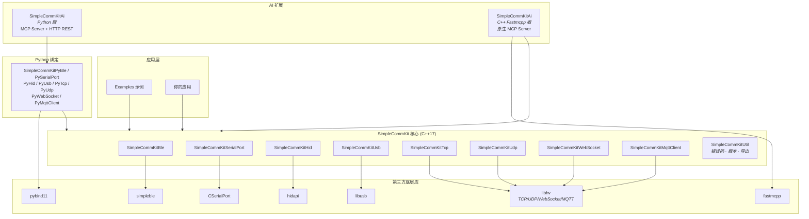

# SimpleCommKit

[](LICENSE)
[](https://en.cppreference.com/w/cpp/17)
[]()

**SimpleCommKit** 是一个跨平台 C++ 通信库，统一封装多种底层通信协议，提供简洁一致的 API，让开发者无需关心各平台的底层实现差异。

---

## ✨ 特性

- **统一 API 风格**：所有协议模块遵循一致的命名和调用模式，降低学习成本
- **跨平台支持**：Windows / Linux / macOS / iOS / Android 全平台覆盖
- **错误码体系**：统一的 32 位分层错误码，快速定位问题来源
- **统一回调机制**：`setCallback_OnXxx` 风格的事件回调，错误处理统一规范
- **PIMPL 设计**：公共接口稳定，实现细节完全隐藏，ABI 兼容性良好
- **TLS/SSL 支持**：TCP、WebSocket、MQTT 均内置 TLS 加密传输
- **自动重连**：TCP、WebSocket、MQTT 客户端支持可配置的指数退避重连策略
- **热插拔检测**：SerialPort、HID、USB 模块支持设备热插拔轮询

---

## 📦 支持的通信协议

| 模块 | 协议 | 模式 |
|------|------|------|
| **SimpleCommKitBle** | 蓝牙低功耗 (BLE) | Central |
| **SimpleCommKitSerialPort** | 串口 (UART/RS-232) | 点对点 |
| **SimpleCommKitHid** | HID 人机接口 | 多设备读写 |
| **SimpleCommKitUsb** | USB 直接通信 | Control/Bulk/Interrupt |
| **SimpleCommKitTcp** | TCP 网络 | Client + Server |
| **SimpleCommKitUdp** | UDP 网络 | Client + Server |
| **SimpleCommKitWebSocket** | WebSocket | Client + Server |
| **SimpleCommKitMqttClient** | MQTT IoT | Pub/Sub Client |

---

## 🚀 快速开始

### BLE 示例

```cpp
#include <SimpleCommKitBle/SimpleCommKitBleCentral.h>

using namespace SimpleCommKit;

SimpleCommKitBleCentral ble;

ble.setCallback_OnDiscovered([&](const SimpleCommKitBlePeripheral& p) {
    std::cout << "发现设备: " << p.name << " [" << p.address << "]" << std::endl;
});

ble.init();
ble.adapter_Scan_Start();
// ...
ble.adapter_Scan_Stop();
ble.close();
```

### TCP 客户端示例

```cpp
#include <SimpleCommKitTcp/SimpleCommKitTcpClient.h>

using namespace SimpleCommKit;

SimpleCommKitTcpClient client;

client.setCallback_OnConnected([&]() {
    std::cout << "已连接" << std::endl;
    client.write("Hello Server!");
});

client.setCallback_OnData([&](const std::vector<uint8_t>& data) {
    std::cout << "收到: " << std::string(data.begin(), data.end()) << std::endl;
});

client.setCallback_OnError([&](ErrorCode code) {
    std::cerr << SimpleCommKitErrorMap::GetErrorDescription(code) << std::endl;
});

client.init();
client.open("127.0.0.1", 8080);
client.start();
// ...
client.stop();
client.close();
```

更多示例请查看 [examples](./examples) 目录。

---

## 📂 项目结构

```
SimpleCommKit/
├── src/                        # 核心源代码
│   ├── SimpleCommKitUtil/      # 工具模块（错误码、版本、导出宏）
│   ├── SimpleCommKitBle/       # BLE 蓝牙
│   ├── SimpleCommKitSerialPort/# 串口通信
│   ├── SimpleCommKitHid/       # HID 设备
│   ├── SimpleCommKitUsb/       # USB 通信
│   ├── SimpleCommKitTcp/       # TCP 客户端/服务器
│   ├── SimpleCommKitUdp/       # UDP 客户端/服务器
│   ├── SimpleCommKitWebSocket/ # WebSocket 客户端/服务器
│   └── SimpleCommKitMqttClient/# MQTT 客户端
├── examples/                   # 10+ 完整示例程序
├── SimpleCommKitAi/            # AI/FastMCP 集成（可选）
├── cmake/                      # 自定义 CMake 模块 & iOS 工具链
├── CMakeLists.txt              # 主构建文件
├── LICENSE                     # MIT 许可证
└── VERSION                     # 版本号
```

---

## 🏗️ 架构概览

```
┌──────────────────────────────────────────────────────────┐
│                    AI 工具层 (SimpleCommKitAi)             │
│   ┌──────────┐  ┌──────────┐  ┌──────────┐               │
│   │MCP Server│  │REST API  │  │  Skills  │  ... x8 协议   │
│   └────┬─────┘  └────┬─────┘  └────┬─────┘               │
├────────┼─────────────┼─────────────┼─────────────────────┤
│        │   Python 绑定 (pybind11)   │                      │
│   ┌────┴─────┐  ┌────┴─────┐  ┌────┴─────┐               │
│   │ PyBle    │  │ PyTcp    │  │ PyMqtt   │  ... x8 协议   │
│   └────┬─────┘  └────┬─────┘  └────┬─────┘               │
├────────┼─────────────┼─────────────┼─────────────────────┤
│        │        C++ 核心库         │                      │
│   ┌────┴────┐ ┌────┴────┐ ┌────┴────┐ ┌──────────┐      │
│   │  BLE    │ │  TCP    │ │  MQTT   │ │  Util    │      │
│   │SerialPort│ │  UDP    │ │WebSocket│ │(ErrorMap)│      │
│   │  HID    │ │         │ │         │ │          │      │
│   │  USB    │ │         │ │         │ │          │      │
│   └────┬────┘ └────┬────┘ └────┬────┘ └──────────┘      │
├────────┼─────────────┼─────────────┼─────────────────────┤
│   simpleble   libusb  CSerialPort  hidapi       libhv    │
└──────────────────────────────────────────────────────────┘
```



---

## 🔨 构建指南

> 📖 完整构建文档请参阅 **[doc/BUILD.md](doc/BUILD.md)**

**快速开始：**

```bash
# 默认配置（TCP + UDP + WebSocket）
cmake -B build
cmake --build build

# 启用更多模块
cmake -B build \
  -DENABLE_SIMPLECOMMKIT_BLE=ON \
  -DENABLE_SIMPLECOMMKIT_SERIALPORT=ON \
  -DENABLE_SIMPLECOMMKIT_MQTTCLIENT=ON \
  -DSIMPLECOMMKIT_EXAMPLES=ON
cmake --build build
```

**各平台快速命令：**

| 平台 | 快速命令 |
|------|----------|
| **macOS / Linux / Windows** | `cmake -B build && cmake --build build` |
| **iOS** | `cmake -B build_ios -DCMAKE_TOOLCHAIN_FILE=cmake/ios.toolchain.cmake` |
| **Android** | `cmake -B build_android -DCMAKE_TOOLCHAIN_FILE=$ANDROID_NDK/...` |

完整指南包含环境要求、全部 CMake 选项、依赖说明、各平台详细配置及常见问题排查，详见 **[doc/BUILD.md](doc/BUILD.md)**。

---

## 🔌 可选扩展

### Python 绑定 (pybind11)

启用 `ENABLE_SIMPLECOMMKITPYBIND` 后，可通过 pybind11 为每个通信模块生成原生 Python 扩展模块（如 `SimpleCommKitPyBle`、`SimpleCommKitPySerialPort` 等），方便在 Python 脚本中直接调用底层 C++ API。

### SimpleCommKitAi (AI 集成工具包)

`SimpleCommKitAi` 是 AI 友好的通信工具包层，将各通信协议的能力通过 MCP (Model Context Protocol) 暴露给 AI Agent，让 AI 能够直接操控硬件设备。提供两种集成方式：

| 版本 | 类型 | 说明 |
|------|------|------|
| **Python 版** | `pip install` 包 | 纯 Python 实现，基于 `fastmcp` + `fastapi` + `uvicorn`，提供 MCP Server 和 HTTP REST API，灵活易集成 |
| **C++ Fastmcpp 版** | 原生可执行程序 | 纯 C++ 实现，基于 `fastmcpp`，零 Python 依赖，高性能。通过 `ENABLE_SIMPLECOMMKITAI_FASTMCPP` 编译生成 |

两种版本均支持 stdio / SSE / HTTP 等多种传输模式，可接入 Cursor、Claude Code 等 AI 客户端。

---

## 📄 许可证

本项目基于 [MIT License](./LICENSE) 开源。

---

## 🤝 贡献

欢迎提交 Issue 和 Pull Request！在提交前，请确保：

1. 代码遵循项目现有的代码风格
2. 新功能附带相应的示例代码
3. 通过所有编译检查

---

*让通信变得简单。*
